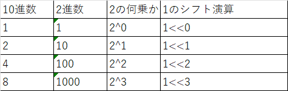

----
#### ABC 325
##### - A問題  
  - 時間系の問題   
    - 時間系で24時間超えた場合24で割ったあまりが時間になる

----
#### ABC 324
##### - C問題  
  - 部分列の判定
  - 貪欲法を使う

----
#### ABC 323
##### - A問題  
  - ビット演算  
-------------------------------------------------------------
#### ABC 321  
##### - A問題  
 - 数値のChar型 - '0'でint型変換

##### - B問題  
 - 全探索系
 - a.back()でvectorの末尾の要素取り出せる
##### - C問題
   - bit全探索の問題
   - 部分集合  

----------------------------------------
#### ABC 317

##### - C問題
   - 重み付き無向グラフ
   - 全探索→再帰関数 （ラムダ式）
---

#### メモ  

 - まずは全探索できないか  
 - TLEの目安は10の8乗  

 - 色々な数値の表し方  
    

 - 単調性があるときは二分探索ができる  
 - 1e9 = 10の9乗 2e3 = 2*10の3乗
 ----------------------------------------
#### ABC 323   
  - 二分探索

### visusalstudio の事   
 - Alt + Shift + 矢印キー ：　矩形選択
